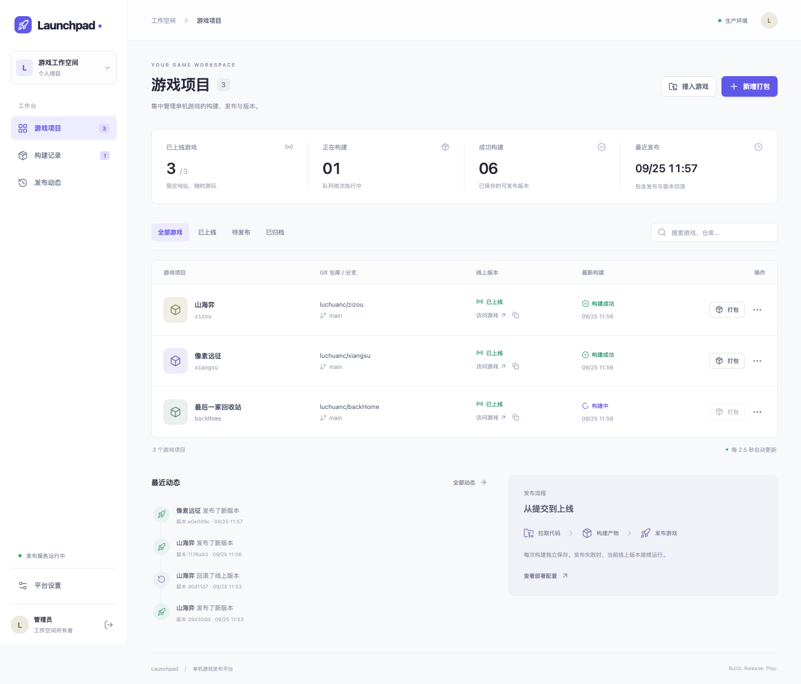

# Launchpad · 单机游戏打包发布平台

从远端 Git 仓库拉取代码，构建静态游戏，生成固定访问地址，并管理发布和回滚。游戏本身不需要服务端；平台使用 Node.js 管理构建、登录和静态文件托管。



## 功能

- 默认接入 `zizou`（山海弈）、`xiangsu`（像素远征）、`backHome`（最后一家回收站）。
- 新增游戏、编辑仓库/分支/命令/产物目录、归档与恢复游戏。
- 顺序构建队列，独立 Git 克隆目录、确切提交 SHA、实时轮询日志、日志下载、超时、取消、失败重试。
- 构建后自动发布，或仅保存产物后手动发布。
- 保存历史成功产物，任意版本发布、一键回滚上一版。访问地址固定；发布与回滚记录在 SQLite 事务中一起更新。
- 失败或取消的构建不影响线上版本；重启后运行中的构建标为失败，排队任务恢复执行。
- 管理密码、HttpOnly 会话、来源校验、登录失败限流。游戏在独立端口/域名托管，不能访问管理 API。

## 本机运行

要求 Node.js **24.11+（24 LTS）**、npm、Git、SSH；Linux 和 macOS 均可。使用 `nvm use` 切换版本。

```sh
npm ci
npm run setup
npm run build
npm start
```

`setup` 只在不存在 `.env` 时生成配置，创建随机密码并以权限 0600 保存，不打印密码。用编辑器打开 `.env` 查看 `ADMIN_PASSWORD`，打开 <http://127.0.0.1:8080> 登录。后台默认接入三个游戏，点击“新增打包”拉取远端代码。未发布时游戏端口返回 503，首次成功发布后页面显示可用地址。

本机默认地址：

| 应用 | 地址 |
| --- | --- |
| 发布后台 | `http://127.0.0.1:8080` |
| 山海弈 | `http://127.0.0.1:8201` |
| 像素远征 | `http://127.0.0.1:8202` |
| 最后一家回收站 | `http://127.0.0.1:8203` |

首次启动按上述顺序分配端口，新增项目依次分配；端口与游戏标识创建后保持不变。UI 自动轮询，每 2.5 秒更新状态，日志每 1.8 秒更新。

## Linux：Docker Compose 部署

```sh
git clone git@github.com:luchuanc/publishing.git
cd publishing
cp .env.example .env
mkdir -p deploy/ssh
```

编辑 `.env`，至少设置：

```dotenv
PUBLIC_URL=http://你的服务器IP:8080
GAME_PUBLIC_HOST=你的服务器IP
ADMIN_PASSWORD=替换成至少12位的唯一管理密码
GAME_PORT_START=8201
GAME_PORT_END=8299
```

GitHub 的 SSH 仓库需要服务器自己的读取权限。将专用 SSH 私钥、配置及**已验证**的 `known_hosts` 放入 `deploy/ssh/`。不需要给服务器推送权限。使用 SSH agent 的本机直接运行方式可沿用现有 SSH 配置；容器不会自动继承宿主机 agent。

```sh
# 容器使用 node 用户 UID 1000。不要对其他 SSH 目录执行此命令。
sudo chown -R 1000:1000 deploy/ssh
sudo chmod 700 deploy/ssh
sudo chmod 600 deploy/ssh/id_ed25519
# known_hosts 至少需要 GitHub 主机公钥。先与 GitHub 官方指纹比对，勿禁用主机校验。
docker compose up -d --build
docker compose logs -f publishing
```

每个 SSH deploy key 通常对应一个仓库。多个仓库可使用具有这些仓库读取权限的专用 GitHub 机器账号，或在 SSH config 中为各仓库配置不同 Host 别名和 IdentityFile，并在平台仓库地址使用对应别名。公有仓库也可改用 `https://github.com/luchuanc/项目名.git`，免 SSH。

容器内构建会执行 `npm ci` 等命令，需要访问 npm 和 GitHub。数据在 `publishing-data` 命名卷，重新构建容器不会删除版本和记录。**不要使用 `docker compose down -v`，它会删除发布数据。** 防火墙放行 8080 和实际使用的游戏端口；同一数据卷只运行一个实例。

### 独立域名与 HTTPS

提供 `deploy/nginx.conf.example`。将管理后台和每个游戏分别反向代理到自己的端口，全部使用站点根路径 `/`，不要将游戏挂到后台的子路径。游戏已有大量根路径资源，独立 origin 也能隔离 Service Worker、浏览器存档和管理页面。

- 为后台和游戏配置 DNS 与 HTTPS。
- `.env` 设置 `PUBLIC_URL=https://publish.example.com`、`COOKIE_SECURE=true`。使用反向代理时设置 `BIND_ADDRESS=127.0.0.1`，避免公网直接访问映射端口。
- 在每个游戏设置中填写已配置好的独立域名，如 `https://zizou.example.com`。
- `PUBLIC_URL` 必须和浏览器中的管理地址完全一致，否则修改请求会被来源校验拒绝。配置域名只修改显示地址，不自动创建 DNS 或证书。
- 上线/回滚后刷新游戏读取新版本；已打开的游戏不会被强制中断。山海弈保留离线缓存，联网时优先读取服务器，离线时读取缓存。PWA 离线能力需要 HTTPS 或 localhost。

### 不使用 Docker

在 Linux 安装 Node 24、Git、OpenSSH，使用专用普通用户运行，执行与本机相同的安装命令。可用 `deploy/publishing.service` 启动 systemd 服务，按实际安装目录与 Node 路径调整。`.env` 的 `HOST=0.0.0.0` 允许外部访问；管理密码与 Git SSH 权限分别配置。

### 只有普通用户权限

如果无法访问 Docker，也没有 systemd 用户服务，服务器已有的 cron 可以托管本应用。先完成 `npm ci`、构建与 `.env` 配置，然后运行：

```sh
sh deploy/install-user-service.sh /完整路径/node
```

Node 必须为 24 版本，例如 `/home/your-user/.nvm/versions/node/v24.21.0/bin/node`。安装脚本保留原有用户任务，添加本应用的开机启动和每分钟恢复检查，使用 `flock` 保证只启动一个实例；它不会修改系统用户权限。服务由 cron 启动，因此临时部署终端断开后仍继续运行。

- 日志：`.data/service.log`；进程号：`.data/service.pid`。
- 停止：删除 `.data/service.enabled`，核对进程号对应本应用后终止该进程。
- 恢复：创建 `.data/service.enabled`，等待最多一分钟。
- 更新：拉取代码并重新构建，终止当前服务进程，cron 会在一分钟内恢复。检查 `/healthz` 与游戏访问地址。
- 完全卸载自启动：在 `crontab -e` 中仅删除 `BEGIN publishing-user-service` 与 `END publishing-user-service` 之间的块，保留其他任务。

## 游戏接入约定

| 仓库 | 安装 | 构建 | 产物 |
| --- | --- | --- | --- |
| `git@github.com:luchuanc/zizou.git` | `npm ci` | `npm run build` | `dist/` |
| `git@github.com:luchuanc/xiangsu.git` | `npm ci` | `npm run build` | `dist/` |
| `git@github.com:luchuanc/backHome.git` | 无依赖，留空 | `npm run build` | `dist/` |

新增项目默认构建 `main` 分支，每次克隆这个分支当时的最新提交。分支可以修改，暂不提供 tag/任意 SHA 选择。命令在仓库根目录执行。输出必须在仓库内的独立目录，包含 `index.html`，不能含符号链接、隐藏文件或 `node_modules`。Git 子模块、LFS、非 Node 构建工具暂未自动安装。

`backHome` 构建同时保留原来的“最后一家回收站.html”离线文件，以及平台需要的 `dist/index.html`。构建产物不提交到游戏仓库，源码及必要资源提交。

## 数据、更新与备份

- `.data/publishing.sqlite`：项目配置、构建状态、发布事件；启用 WAL。
- `.data/releases/<构建ID>/`：成功构建产物，每个版本独立目录，不覆盖。
- `.data/logs/<构建ID>.log`：最多 4 MB 构建日志。
- `.data/work/`：临时克隆目录，任务结束后清理。
- 默认保留全部成功版本；没有自动清理或配额，请监控磁盘。不能只删线上产物目录。
- 备份时先停止服务，完整备份 `.data`（包括 SQLite WAL 文件）或 Docker 数据卷，再启动。恢复时保持项目端口与域名，避免影响玩家原 origin 下的存档。
- 平台更新：拉取新代码，`npm ci && npm run build` 后重启；Docker 使用 `docker compose up -d --build`。重启会使已有管理会话失效，需要重新登录。
- 游戏回滚不回滚玩家本地存档。游戏代码应保持存档兼容，否则先在游戏中导出备份。

## 安全边界

平台面向单个可信管理员，不是运行陌生代码的公共 CI。Git 依赖安装与自定义构建命令是任意代码执行，会以平台用户身份运行，**不是沙箱**。只接入可信仓库，不以 root 运行，不挂载 Docker socket 或无关凭据。传入构建子进程的环境使用白名单，不包含管理密码；但可信构建仍能访问平台用户可读的本机文件。私钥、密码、`.env`、SQLite 与版本目录均不提交 Git。公网使用 HTTPS。

## 开发与验证

```sh
npm run check
npm test
npm run build
```

测试使用真实临时 Git 仓库与构建命令，覆盖发布/回滚、并发状态保护、旧资源访问、仅构建、失败保留版本、取消、重启恢复、归档恢复、登录与 CSRF、路径隔离和构建超时。`npm run dev` 仅供前端热更新；使用时将服务的 `PUBLIC_URL` 设置为 Vite 地址 `http://localhost:5173`，启动后台后从该地址访问。

前端：React + Vite；后端：Node 内置 HTTP、SQLite、child_process；无外部数据库。需要 Node 24，Node 20 不支持这里使用的 `node:sqlite` API。
